<p align="center">
  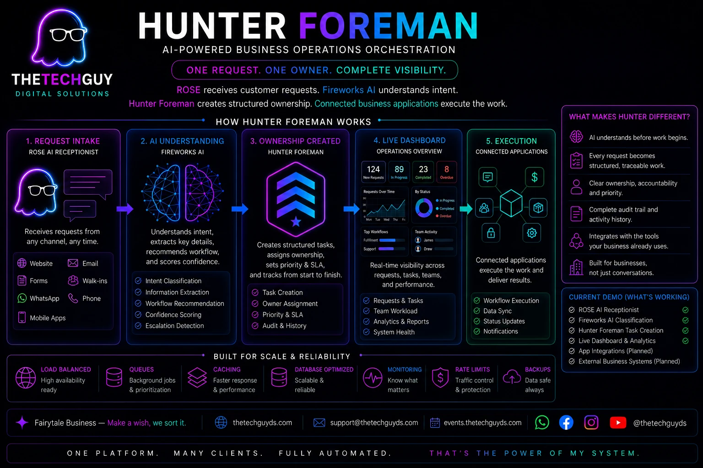
</p>

<p align="center">
  <strong>Live Demo:</strong> <a href="https://hunter-foreman.thetechguyds.com">hunter-foreman.thetechguyds.com</a>
</p>

<p align="center"><em>The diagram presents Hunter Foreman’s complete operating model; the “Current Demo” panel and live application identify the functionality implemented in this hackathon release.</em></p>

# Hunter Foreman

> AI-powered business operations orchestration.

ROSE receives customer requests.  
Fireworks AI understands intent.  
Hunter Foreman creates structured ownership.  
Connected business applications execute the work.

**One request. One owner. Complete visibility.**

---

## The Problem

Businesses receive customer requests through websites, email, WhatsApp, social media, and staff members.

Without structured ownership, requests can be forgotten, duplicated, or delayed.

Hunter Foreman ensures every request immediately becomes owned, traceable work.

---

## How It Works

```text
Customer
   │
   ▼
ROSE AI Receptionist
   │
   ▼
Fireworks AI
(Intent Understanding)
   │
   ▼
Hunter Foreman
(Task Ownership)
   │
   ▼
Operations Dashboard
   │
   ▼
App Bridge
   │
   ▼
Connected Business Applications
```

---

## Fireworks AI Integration

Fireworks AI performs semantic understanding of incoming customer requests.

It is responsible for:

- Intent classification
- Workflow recommendation
- Confidence scoring
- Escalation detection
- Returning structured output that Hunter Foreman can turn into business work

Hunter Foreman then converts those AI decisions into structured business tasks with clear ownership, lifecycle information, dashboard visibility, and optional App Bridge dispatch.

The verified live model used for the Fireworks proof is:

```text
accounts/fireworks/models/gpt-oss-120b
```

The project also keeps fallback behavior explicit so the demo can continue safely if provider credentials are not configured.

---

## Why Hunter Foreman?

Hunter Foreman is not another AI chatbot.

The conversation is only the beginning.

Its purpose is ensuring work is understood, owned, tracked, and delivered across business operations.

---

## Available Today

- ROSE AI Receptionist
- Fireworks AI intent understanding
- Rule-based fallback for demo safety
- Structured task ownership
- Live operations dashboard
- Request log
- Task Board
- Analytics
- App Bridge
- System Health
- Demo reset workflow
- Regional settings, currency, timezone, language, and preferences
- Honest integration states for planned or unavailable modules

---

## Planned / Intentionally Not Connected Yet

These are shown as planned, under maintenance, or not connected in the demo rather than presented as finished production integrations.

- WhatsApp automation
- Payment Gateway
- Event Manager connector
- Invitation System connector
- QR Access connector
- Multi-business deployment
- Additional production App Bridge receivers

This is intentional: planned business modules are visible for product direction, but unfinished integrations are not presented as live.

---

## Demo Walkthrough

A clean walkthrough of Hunter Foreman showing the request moving from ROSE intake into task ownership, dashboard visibility, connected app status, analytics, settings, and system health.

<p align="center">
  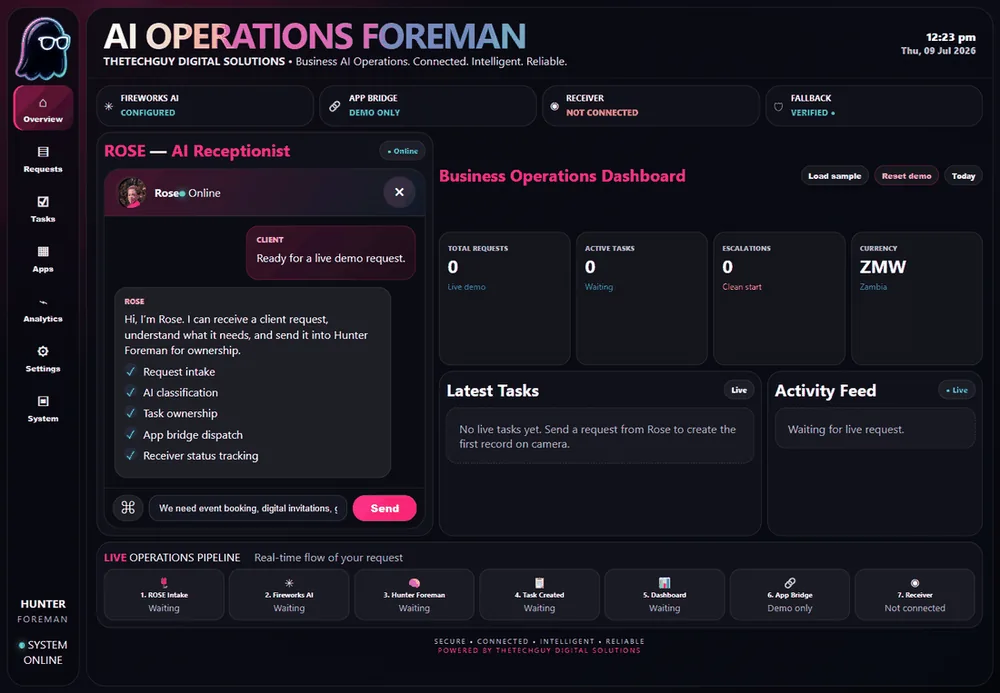
</p>

---

## Screenshots

### Overview

Live operational overview showing ROSE intake, Fireworks AI status, dashboard counters, activity feed, and operations pipeline.

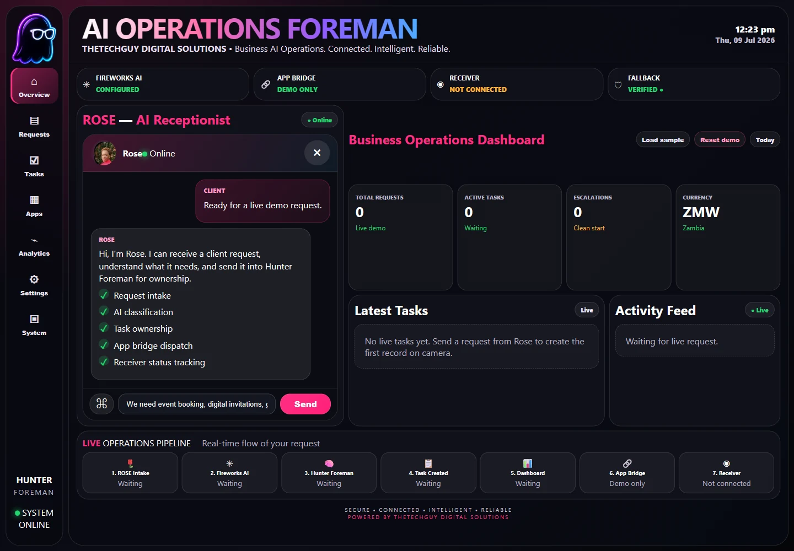

### Request Created

A submitted customer request becomes visible immediately, with dashboard counters and activity feed updates.

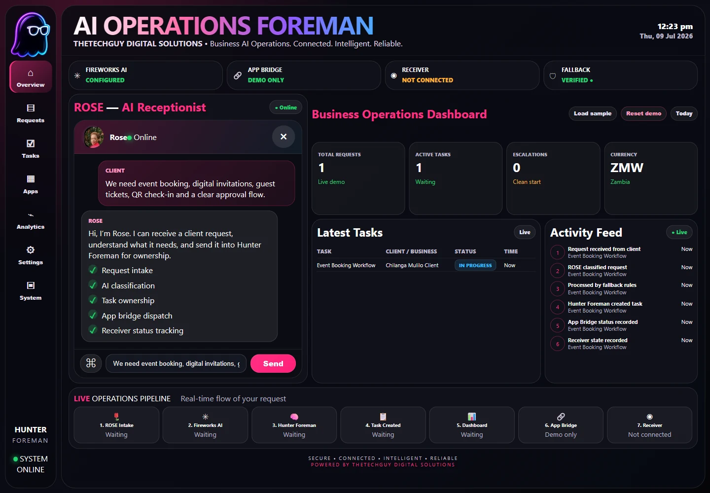

### Requests

The request log shows customer/business details, request summary, status, and traceable request ID.

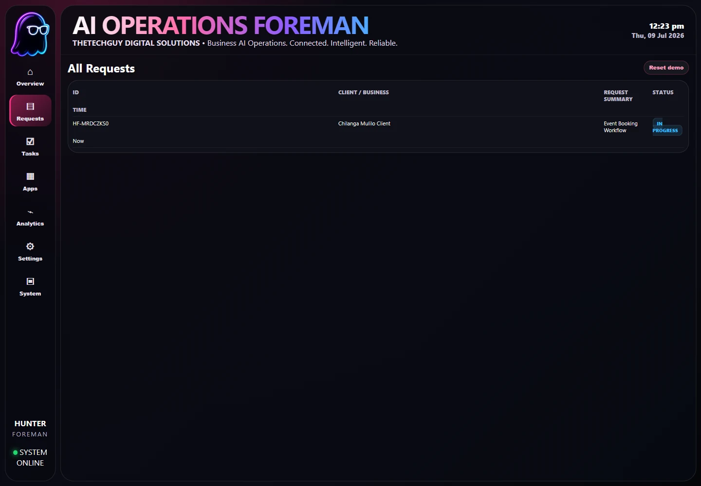

### Task Board

Structured ownership view showing work separated into To Do, In Progress, Pending Review, and Completed.

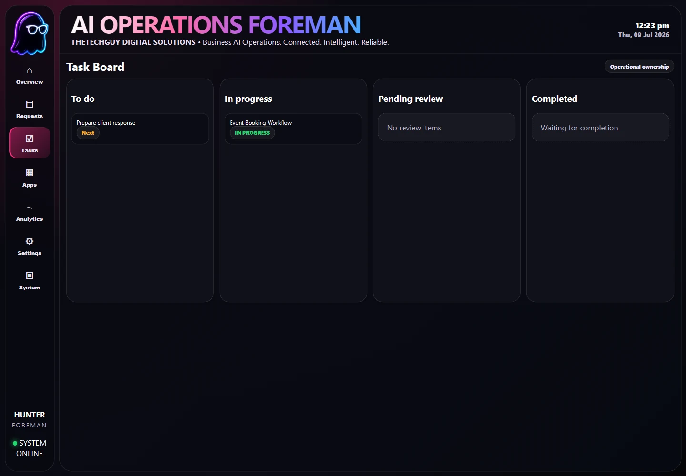

### Connected Apps

App Bridge view showing which business modules are demo-ready, planned, under maintenance, or not connected.

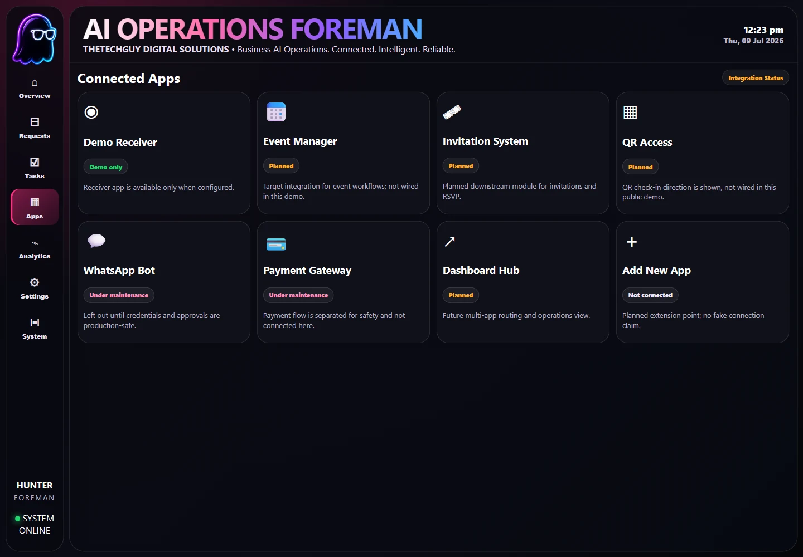

### Analytics

Analytics view showing live demo metrics and task status visibility.

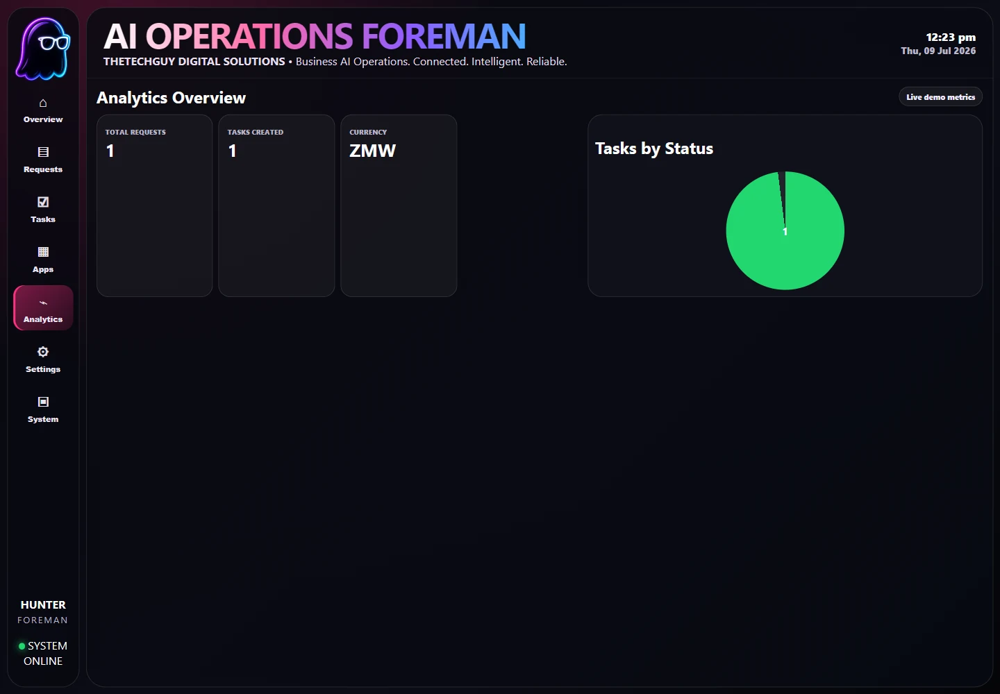

### Settings

Regional and business settings for Zambia, timezone, currency, language, notifications, and owner approval behavior.

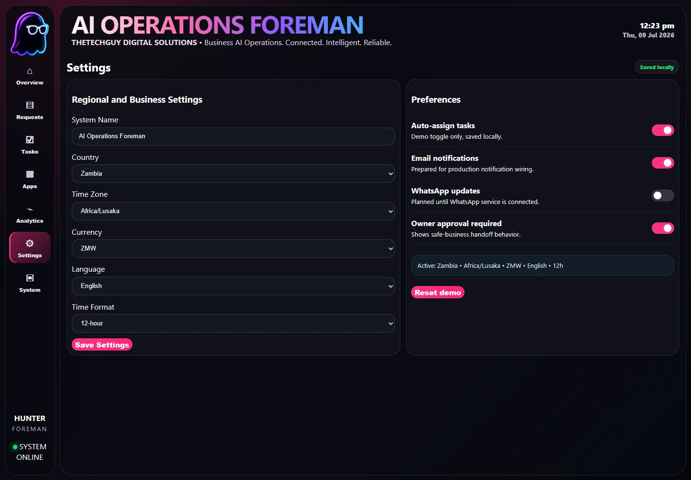

### System Health

System health view showing provider state, App Bridge status, receiver status, logs, and demo readiness.

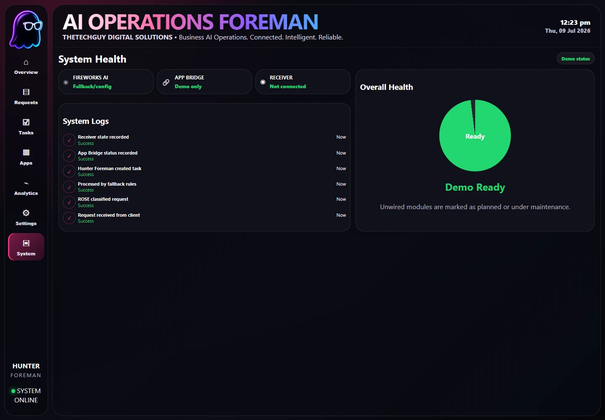

---

## Engineering Principles

Hunter Foreman follows a simple engineering philosophy:

- Claims match implementation.
- Planned functionality is clearly identified.
- Evidence accompanies demonstrations.
- AI decisions remain observable.
- Fallback behavior is explicit.
- Business workflows take priority over chat interactions.

---

## Verification

The repository includes a proof package containing:

- Clean WebP screenshots of all major tabs
- A readable WebP demo walkthrough
- Fireworks classification evidence
- API health output
- App Bridge status output
- Task state after the UI demo
- UI state capture
- Smoke test output
- Docker Compose config validation
- SHA256 checksums

Key proof files:

```text
proof/demo-walkthrough.webp
proof/screenshots/
proof/fireworks-classification-proof.json
proof/api-health.json
proof/api-app-bridge-status.json
proof/api-tasks-after-ui-demo.json
proof/ui-state.json
proof/npm-test-fallback.txt
proof/docker-compose-config.txt
proof/SHA256SUMS.txt
proof/capture-brave-screenshots.js
```

The goal is for every significant implementation claim to be backed by reproducible evidence.

---

## Related Repositories

Hunter Foreman is presented through three public repositories, with Sergeant documented as the supporting engineering reviewer:

- **[hunter-foreman](https://github.com/jaydumisuni/hunter-foreman)** — main application, ROSE intake, Fireworks classification, task ownership, dashboard, App Bridge, Docker setup, and proof artifacts.
- **[hunter-foreman-demo](https://github.com/jaydumisuni/hunter-foreman-demo)** — connected demo receiver that accepts versioned App Bridge task events and proves the workflow can leave the main application.
- **[hunter-foreman-docs](https://github.com/jaydumisuni/hunter-foreman-docs)** — judge-facing submission pack, architecture notes, demo guidance, pitch material, and cross-repository proof documentation.
- **[Sergeant](https://github.com/jaydumisuni/Sergeant)** — independent AI implementation reviewer shaped and validated through Hunter Foreman, focused on claims, documentation, code, runtime behavior, and evidence before release.

Building Hunter Foreman led directly to the creation of Sergeant, and Hunter Foreman served as the first real project used to shape and validate its review workflow.

<p align="center">
  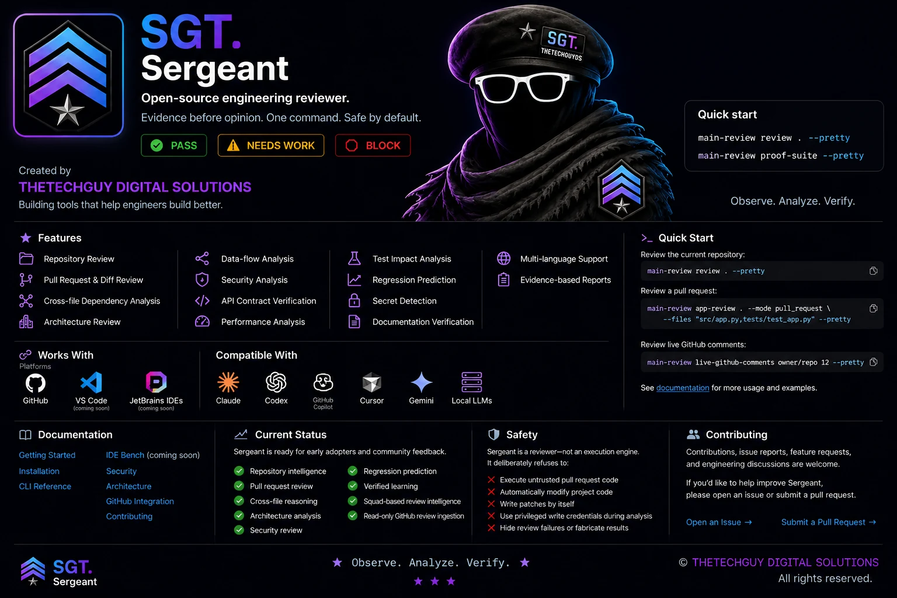
</p>

---

## Roadmap

### Current

Working AI operations demo with ROSE intake, Fireworks classification, task ownership, dashboard visibility, and proof artifacts.

### Business Integrations

Connect real WhatsApp, payment, event, invitation, QR access, and business-specific application receivers.

### Platform Expansion

Move toward multi-business deployment, stronger App Bridge contracts, additional AI providers, and production-grade monitoring.

---

## Repository Structure

```text
apps/
  demo/                 Local demo server and browser UI
packages/
  foreman-core/         Classification, routing, task creation
  app-bridge/           Dispatch boundary for external apps
scripts/                Smoke tests and live provider checks
docs/                   Supporting documentation
proof/                  Local evidence runs and generated proof packages
```

---

## Quick Start

```bash
npm install
npm run dev
```

Open:

```text
http://localhost:3000
```

Run the smoke tests:

```bash
npm test
```

Check the demo server syntax:

```bash
node --check apps/demo/server.js
```

---

## Fireworks Live Test

Set a Fireworks API key and model, then run the live provider check.

```bash
set FIREWORKS_MODEL=accounts/fireworks/models/gpt-oss-120b
node scripts/test-fireworks-live.js
```

Expected evidence from a successful run:

```text
provider=fireworks
fallbackUsed=false
```

Do not commit API keys or provider secrets.

---

## About THETECHGUY DIGITAL SOLUTIONS

Hunter Foreman is developed by **THETECHGUY DIGITAL SOLUTIONS**, a Zambian software engineering business focused on practical business automation, repair tools, AI systems, and connected software platforms.

---

## License

License details should be reviewed before public production use.